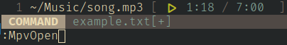

neovimpv
========



A plugin for opening mpv instances based on buffer contents. Simply type a file
path into a buffer and type `:MpvOpen` to open the file in mpv as if you had
invoked it from the command line.


Installation
------------

### Vundle

Place the following in `~/.config/nvim/init.vim`:
```vim
Plugin 'queue-miscreant/neovimpv', {'do', ':UpdateRemotePlugins'}
```
Make sure the file is sourced and run `:PluginInstall`.


Suggested Use
-------------

For the least amount of setup possible, create a keybind in your `init.vim` to
call the omni-function. This allows you to open an mpv instance the first time
the sequence is pressed. Pressing the same sequence again (without moving to
another line) will attempt to capture a keypress to send to mpv.

```vim
nnoremap <silent> <leader>\ :call NeovimpvOmni(1)<cr>
```


Commands
--------

### `:MpvOpen [mpv-args]`

Open an mpv instance using the string on the current line, as if invoking `mpv`
from the command line with the `--no-video` flag. URLs may be used if youtube-dl
or yt-dlp has been set up.

To decrease reliance on IPC, some rudimentary checks are performed to ensure that
the file exists or is a URL. 

Optionally `mpv-args` may be given, which are passed as command line
arguments. This can be used to override `--no-video`, for example, by
calling `:MpvOpen --video=auto`

If {mpv-args} overrides the default `--no-video` flag (i.e., if a
window is anticipated to open), the media data will NOT be rendered in
an extmark.


### `:MpvClose [all]`

Close an mpv instance displayed on the current line.

If `all` is specified, every mpv instance bound to the current buffer is closed.


### `:MpvSend command-name [...command-args]`

Send a command to the mpv instance running on the current line. See
[this](https://mpv.io/manual/stable/#json-ipc) part of the mpv
documentation for more information about commands.

Some example commands include `seek {seconds}` and `quit`.


### `:MpvSetProperty property-name property-value`
        
Set a property on the mpv instance running on the current line. See
[this](https://mpv.io/manual/stable/#property-list) part of the mpv
documentation for more information about properties.

Property values are evaluated to their JSON value prior to being reserialized
and sent to mpv. For example, the literal `60` will send a number, while `"60"`
and `foo` will send strings.

Some useful example properties:

- `volume`
    - Percentage volume, ranging from 0-100.
- `loop`
    - Number of times the content should loop. Valid values include numbers, `"none"`, and `"inf"`.
- `playback-time`
    - Current playback position. You can change this relatively using the `seek` command.

This command is equivalent to using MpvSend with first argument `set_property`.


### `:MpvPause [all]`

Toggle the pause status of the mpv instance running on the current line. If `all` is
specified, every mpv instance bound to the current buffer is paused (NOT toggled).

This command is equivalent to `:MpvSend set_property pause <not pause state>`


Functions
---------

### `MpvSendNvimKeys(extmark_id, keypress_string)`

Send `keypress_string`, a string signifying a nvim keypress event, to
the mpv instance identified by `extmark_id`.

The plugin is able to translate SOME of these into mpv equivalents,
but not all. You should not rely on proper handling of modifier keys
(Ctrl, Alt, Shift, Super).


### `NeovimpvOmni(start_mpv)`

Attempt to capture a keypress and send it to the mpv instance running
on the current line. If no instance is found, then `start_mpv` decides
whether or not to call `:MpvOpen` or report that no instance was
found.


Configuration
-------------

The following global variables may be placed in your vim init script. If they
are changed while neovim is running, they will NOT take effect.


### `g:mpv_default_highlight`

Name of highlight to be used by default when drawing text for the mpv
instance.

The default value is `"LineNr"`.


### `g:mpv_loading`

String to be displayed while an mpv instance is still loading. Uses
the default highlight defined in `g:mpv_default_highlight`.

The default value is `"[ ... ]"`


### `g:mpv_format`

Format string to use when drawing text for an mpv instance. Each
field which is intended to represent an mpv property must be
surrounded by curly braces ({}). 

Some formats are drawn internally to the plugin:
- `duration` and `playback-time` will both render in a familiar time
  format, and will be highlighted as `"Conceal"` by default.

- `pause` will render using typical pause and play symbols, instead of
  the string representations "True" and "False". It also uses the
  highlights `"Conceal"` and `"Title"` when `True` and `False`,
  respectively.

The default value is `"[ {pause} {playback-time} / {duration} {loop} ]"`


### `g:mpv_style`

Style to use when drawing pictographic fields. Possible values are
`"unicode"`, `"ligature"`, and `"emoji"`.
Currently, the only pictographic field is "pause".

The default value is `"unicode"`


### `g:mpv_highlights`

Dictionary of additional highlights which will be used when rendering
the contents of `g:mpv_format`. These values will override the
default highlights mentioned there.

The keys in this dictionary should be mpv property names and the
values should be valid highlight names.

To use a different highlight for properties with a certain (discrete)
value, you may also specify a key as `{mpv-property}@value`. The value
will be evaluated as a JSON before being compared to its actual value.


### `g:mpv_markdown_writable`

List of filetypes which, when a line is opened using `:MpvOpen`,
will format the line into markdown, if it isn't already. The format
used is `[{mpv-title}]({original-link})`.

This option is best used in files which support syntax that hides link contents.


### `g:mpv_default_args`

List of arguments to be supplied to mpv when an instance is opened
with `:MpvOpen`. Note that `--no-video` is always implied, unless it
is overridden by `--video=auto`.


TODOs
-----

- Youtube search support
- Improve sending keys
